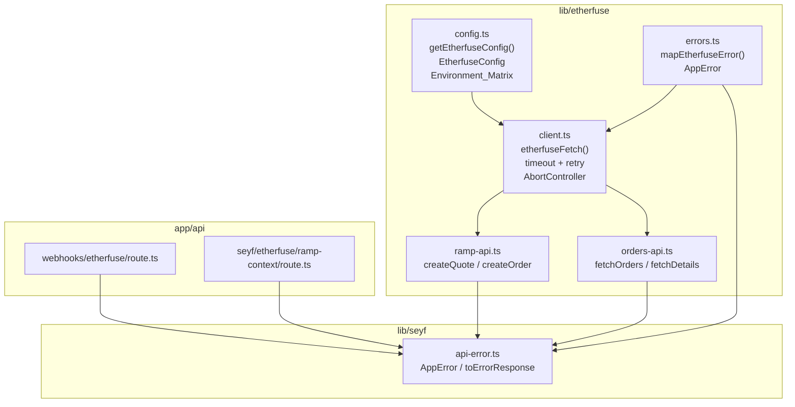

# Design Document: etherfuse-client-hardening

## Overview

This feature hardens the shared Etherfuse integration surface so every ramp flow (on-ramp and
off-ramp) uses a single, consistently configured HTTP client. The work touches four modules in
`lib/etherfuse/` and two route handlers in `app/api/`.

Current pain points:

- `config.ts` only validates `ETHERFUSE_API_KEY`; other required variables are read ad-hoc via
  `process.env` scattered across `ramp-api.ts`, `integration-model.ts`, and the webhook route.
- `client.ts` wraps `fetch` but has no timeout, no retry, and throws plain `Error` instances with
  raw provider text.
- `ramp-api.ts` and `orders-api.ts` throw `new Error(...)` with raw Etherfuse bodies, bypassing
  the stable `SeyfErrorCode` / `AppError` shape.
- `app/api/webhooks/etherfuse/route.ts` reads `process.env.ETHERFUSE_WEBHOOK_SECRET` directly and
  returns raw error strings to callers.
- `app/api/seyf/etherfuse/ramp-context/route.ts` uses `toErrorMessage` (plain string) instead of
  `toErrorResponse` (structured `SeyfErrorBody`).

After this change every outbound call goes through one hardened client, every failure surfaces as
an `AppError`, and every route handler returns a `SeyfErrorBody` via `toErrorResponse`.

---

## Architecture



Key design decisions:

1. **Error mapper lives in `lib/etherfuse/errors.ts`** — keeps `client.ts` focused on transport
   and makes the mapping logic independently testable.
2. **`getEtherfuseConfig()` collects all validation errors** before throwing, so a misconfigured
   deploy surfaces every problem at once.
3. **Retry is opt-in for writes** — POST/PUT/PATCH/DELETE never retry unless the caller passes
   `retryable: true`, preventing silent order duplication.
4. **`AbortController` per request** — each call gets its own controller so a timeout on one
   request cannot cancel an unrelated concurrent request.

---

## Components and Interfaces

### `lib/etherfuse/config.ts` (updated)

```typescript
export type EnvTier = "local" | "sandbox" | "production";

export type EnvVarSpec = {
  name: string;
  tiers: EnvTier[];
  required: boolean;
  defaultValue?: string;
  description: string;
};

/** Environment_Matrix — single source of truth for all Etherfuse env vars. */
export const ETHERFUSE_ENV_MATRIX: EnvVarSpec[] = [
  {
    name: "ETHERFUSE_API_KEY",
    tiers: ["local", "sandbox", "production"],
    required: true,
    description: "API key for Etherfuse (no Bearer prefix). See .env.example.",
  },
  {
    name: "ETHERFUSE_API_BASE_URL",
    tiers: ["local", "sandbox", "production"],
    required: false,
    defaultValue: "https://api.sand.etherfuse.com",
    description: "Base URL for Etherfuse API. Must start with https://.",
  },
  {
    name: "ETHERFUSE_WEBHOOK_SECRET",
    tiers: ["production"],
    required: true,
    description: "Base64 HMAC secret for webhook signature verification.",
  },
  {
    name: "SEYF_ALLOW_ETHERFUSE_RAMP",
    tiers: ["production"],
    required: true,
    description: 'Must be "true" to enable ramp routes in production.',
  },
  // optional vars (no validation failure)
  {
    name: "ETHERFUSE_DEFAULT_BLOCKCHAIN",
    tiers: ["local", "sandbox", "production"],
    required: false,
    defaultValue: "stellar",
    description: "Default blockchain for ramp operations.",
  },
  {
    name: "ETHERFUSE_ONRAMP_TARGET_ASSET",
    tiers: ["local", "sandbox"],
    required: false,
    description: "Override for onramp target asset identifier.",
  },
  {
    name: "ETHERFUSE_OFFRAMP_SOURCE_ASSET",
    tiers: ["local", "sandbox"],
    required: false,
    description: "Override for offramp source asset identifier.",
  },
];

export type EtherfuseConfig = {
  baseUrl: string;
  apiKey: string;
  webhookSecret: string | null;
  allowRamp: boolean;
};

/**
 * Validates all Etherfuse env vars and returns a typed config object.
 * Collects ALL validation errors before throwing (fail-fast, not fail-first).
 */
export function getEtherfuseConfig(): EtherfuseConfig;
```

### `lib/etherfuse/errors.ts` (new)

```typescript
import { AppError } from "@/lib/seyf/api-error";

/**
 * Translates a raw Etherfuse HTTP response status into an AppError.
 * The raw provider message is stored in AppError.message for server-side
 * logging only — it is never forwarded to API clients.
 */
export function mapEtherfuseHttpError(
  status: number,
  providerMessage: string,
): AppError;

/**
 * Translates a network-level or timeout error into an AppError.
 */
export function mapEtherfuseNetworkError(cause: unknown): AppError;
```

Mapping table:

| HTTP status   | `SeyfErrorCode`        | `statusCode` | `retryable` |
| ------------- | ---------------------- | ------------ | ----------- |
| 429           | `provider_unavailable` | 429          | true        |
| 502, 503      | `provider_unavailable` | 502          | true        |
| 504 / timeout | `provider_unavailable` | 504          | true        |
| 5xx (other)   | `provider_unavailable` | 502          | false       |
| 4xx (≠429)    | `generic_error`        | 400          | false       |

### `lib/etherfuse/client.ts` (updated)

```typescript
export const ETHERFUSE_DEFAULT_TIMEOUT_MS = 10_000;
export const ETHERFUSE_MAX_RETRIES = 3;

export type EtherfuseFetchOptions = Omit<RequestInit, "headers"> & {
  headers?: HeadersInit;
  timeoutMs?: number;
  /** Opt-in retry for non-idempotent writes. Default: false for POST/PUT/PATCH/DELETE. */
  retryable?: boolean;
};

/**
 * Hardened fetch wrapper:
 * - Injects Authorization header from getEtherfuseConfig()
 * - Enforces timeout via AbortController
 * - Retries idempotent GETs (and explicit retryable writes) on 429/502/503/504
 *   with exponential backoff: 200 * 2^attempt ms
 * - Maps all failures to AppError via mapEtherfuseHttpError / mapEtherfuseNetworkError
 */
export async function etherfuseFetch(
  path: string,
  init?: EtherfuseFetchOptions,
): Promise<Response>;
```

Retry logic:

- GET requests: retry up to `ETHERFUSE_MAX_RETRIES` times on network errors or status 429/502/503/504.
- POST/PUT/PATCH/DELETE: no retry unless `retryable: true` is passed.
- No retry on 4xx (except 429).
- Backoff: `200 * 2^attempt` ms (attempt 0 = 200 ms, attempt 1 = 400 ms, attempt 2 = 800 ms).

### `lib/etherfuse/ramp-api.ts` (updated)

No interface changes. All `throw new Error(...)` blocks replaced with `throw mapEtherfuseHttpError(res.status, msg)`.

### `lib/etherfuse/orders-api.ts` (updated)

No interface changes. Same replacement as ramp-api. `fetchOrderDetailsWithRetry` delegates to the
client-level retry instead of its own ad-hoc loop.

### `app/api/webhooks/etherfuse/route.ts` (updated)

- Removes direct `process.env.ETHERFUSE_WEBHOOK_SECRET` read; uses `getEtherfuseConfig()`.
- Wraps handler body in try/catch; returns `toErrorResponse(e, "webhooks/etherfuse")` on failure.

### `app/api/seyf/etherfuse/ramp-context/route.ts` (updated)

- Wraps handler body in try/catch; returns `toErrorResponse(e, "ramp-context")` on failure.
- Removes `toErrorMessage` import; uses `toErrorResponse` for all error paths.

---

## Data Models

### `EtherfuseConfig`

```typescript
type EtherfuseConfig = {
  /** Validated base URL, trailing slash stripped, must start with https://. */
  baseUrl: string;
  /** Non-empty API key. */
  apiKey: string;
  /** HMAC secret for webhook verification; null when not configured (non-production only). */
  webhookSecret: string | null;
  /** Whether ramp routes are enabled (SEYF_ALLOW_ETHERFUSE_RAMP === "true"). */
  allowRamp: boolean;
};
```

### `EnvVarSpec`

```typescript
type EnvVarSpec = {
  name: string;
  tiers: EnvTier[]; // which deployment tiers this var applies to
  required: boolean;
  defaultValue?: string;
  description: string;
};
```

### `AppError` (existing, unchanged)

```typescript
class AppError extends Error {
  readonly code: SeyfErrorCode; // "provider_unavailable" | "generic_error" | ...
  readonly statusCode: number;
  readonly retryable: boolean;
}
```

### `SeyfErrorBody` (existing, unchanged)

```typescript
type SeyfErrorBody = {
  error: {
    code: SeyfErrorCode;
    message_es: string;
    retryable: boolean;
  };
};
```

---

## Correctness Properties

_A property is a characteristic or behavior that should hold true across all valid executions of a
system — essentially, a formal statement about what the system should do. Properties serve as the
bridge between human-readable specifications and machine-verifiable correctness guarantees._

### Property 1: Config validation round-trip

_For any_ set of environment variables where all required fields are present and well-formed,
`getEtherfuseConfig()` should return an `EtherfuseConfig` object whose `baseUrl`, `apiKey`,
`webhookSecret`, and `allowRamp` fields exactly reflect the provided values (with trailing slash
stripped from `baseUrl`).

**Validates: Requirements 1.6**

---

### Property 2: Missing API key always throws

_For any_ environment where `ETHERFUSE_API_KEY` is absent or is a string composed entirely of
whitespace, calling `getEtherfuseConfig()` should throw an `Error` whose message contains the
string `"ETHERFUSE_API_KEY"` and references `.env.example`.

**Validates: Requirements 1.2**

---

### Property 3: Non-HTTPS base URL always throws

_For any_ string value of `ETHERFUSE_API_BASE_URL` that does not begin with `"https://"`,
calling `getEtherfuseConfig()` should throw an `Error` whose message indicates an invalid URL
format.

**Validates: Requirements 1.3**

---

### Property 4: All validation errors collected before throwing

_For any_ environment where multiple required variables are simultaneously invalid, calling
`getEtherfuseConfig()` should throw a single `Error` whose message contains the name of every
failing variable (not just the first one encountered).

**Validates: Requirements 1.7**

---

### Property 5: Timeout produces AppError provider_unavailable 504

_For any_ call to `etherfuseFetch` where the underlying `fetch` does not resolve within the
configured `timeoutMs`, the function should throw an `AppError` with `code === "provider_unavailable"`
and `statusCode === 504`.

**Validates: Requirements 2.3**

---

### Property 6: Custom timeoutMs overrides the default

_For any_ positive integer `t` passed as `timeoutMs`, `etherfuseFetch` should abort the request
after `t` milliseconds rather than after `ETHERFUSE_DEFAULT_TIMEOUT_MS`.

**Validates: Requirements 2.2**

---

### Property 7: GET retries if and only if the status is retryable

_For any_ GET request, `etherfuseFetch` should retry the call when the response status is in
`{429, 502, 503, 504}` or a network error occurs, and should NOT retry when the response status
is any other value (including 4xx statuses other than 429). The total number of attempts should
not exceed `ETHERFUSE_MAX_RETRIES + 1`.

**Validates: Requirements 3.1, 3.4, 3.5**

---

### Property 8: Non-GET writes do not retry without explicit opt-in

_For any_ POST, PUT, PATCH, or DELETE request where `retryable` is not set to `true`, if the
response status is 503, `etherfuseFetch` should call the underlying `fetch` exactly once and
throw without retrying.

**Validates: Requirements 3.2**

---

### Property 9: Exponential backoff between retry attempts

_For any_ GET request that triggers retries, the delay before attempt `n` (0-indexed) should
equal `200 * 2^n` milliseconds.

**Validates: Requirements 3.3**

---

### Property 10: Exhausted retries throw AppError provider_unavailable

_For any_ GET request where every attempt returns a retryable status code, after
`ETHERFUSE_MAX_RETRIES` retries are exhausted, `etherfuseFetch` should throw an `AppError` with
`code === "provider_unavailable"`.

**Validates: Requirements 3.6**

---

### Property 11: HTTP 5xx maps to provider_unavailable 502

_For any_ HTTP response status in the range 500–599 (excluding 504, which maps to 504),
`mapEtherfuseHttpError` should return an `AppError` with `code === "provider_unavailable"` and
`statusCode === 502`.

**Validates: Requirements 4.1**

---

### Property 12: HTTP 4xx (not 429) maps to generic_error 400

_For any_ HTTP response status in the range 400–499 excluding 429, `mapEtherfuseHttpError`
should return an `AppError` with `code === "generic_error"` and `statusCode === 400`.

**Validates: Requirements 4.4**

---

### Property 13: Raw provider message stays server-side

_For any_ `AppError` produced by `mapEtherfuseHttpError` with a non-empty `providerMessage`,
the `AppError.message` field should contain that provider message, and the JSON body returned by
`toErrorResponse` should NOT contain it.

**Validates: Requirements 4.5**

---

## Error Handling

### Config validation errors

`getEtherfuseConfig()` collects all validation failures into a `string[]` and throws a single
`Error` at the end. This means a deploy with three misconfigured variables surfaces all three in
one log line rather than requiring three separate deploys to discover them.

```
Error: Etherfuse config validation failed:
  - ETHERFUSE_API_KEY: missing or empty. See .env.example.
  - ETHERFUSE_API_BASE_URL: must start with https://. Got: "http://api.etherfuse.com"
  - ETHERFUSE_WEBHOOK_SECRET: required in production. See .env.example.
```

### HTTP timeout errors

When `AbortController` fires, the `fetch` promise rejects with a `DOMException` (name
`"AbortError"`). `etherfuseFetch` catches this and calls `mapEtherfuseNetworkError`, which
returns `new AppError("provider_unavailable", { statusCode: 504, message: "Request timed out" })`.

### Retry exhaustion errors

After `ETHERFUSE_MAX_RETRIES` failed attempts, `etherfuseFetch` throws
`new AppError("provider_unavailable", { message: \`All ${ETHERFUSE_MAX_RETRIES} retries exhausted. Last status: ${lastStatus}\` })`.

### Route handler errors

Both `app/api/webhooks/etherfuse/route.ts` and `app/api/seyf/etherfuse/ramp-context/route.ts`
wrap their entire handler body in `try/catch` and return `toErrorResponse(e, context)`. This
ensures:

- `AppError` instances are forwarded with their stored `code` / `statusCode`.
- Plain `Error` instances from Etherfuse (legacy paths not yet migrated) are caught by the
  `isEtherfuseError` branch in `toErrorResponse` and mapped to `provider_unavailable`.
- All other errors become `generic_error`.

---

## Testing Strategy

### Dual approach

Both unit tests and property-based tests are required. They are complementary:

- Unit tests cover specific examples, integration points, and edge cases.
- Property tests verify universal invariants across many generated inputs.

### Property-based testing library

Use **[fast-check](https://github.com/dubzzz/fast-check)** (TypeScript-native, works with
Vitest). Each property test runs a minimum of **100 iterations**.

Tag format for each test:

```
// Feature: etherfuse-client-hardening, Property N: <property_text>
```

### Property test mapping

| Design Property                        | Test file                                | fast-check arbitraries                                                     |
| -------------------------------------- | ---------------------------------------- | -------------------------------------------------------------------------- |
| P1: Config round-trip                  | `lib/etherfuse/__tests__/config.test.ts` | `fc.record({ apiKey: fc.string({ minLength: 1 }), baseUrl: fc.webUrl() })` |
| P2: Missing API key throws             | `lib/etherfuse/__tests__/config.test.ts` | `fc.oneof(fc.constant(""), fc.string().map(s => s.replace(/\S/g, " ")))`   |
| P3: Non-HTTPS URL throws               | `lib/etherfuse/__tests__/config.test.ts` | `fc.string().filter(s => !s.startsWith("https://"))`                       |
| P4: All errors collected               | `lib/etherfuse/__tests__/config.test.ts` | Multiple invalid vars simultaneously                                       |
| P5: Timeout → AppError 504             | `lib/etherfuse/__tests__/client.test.ts` | `fc.integer({ min: 1, max: 500 })` for timeoutMs                           |
| P6: Custom timeoutMs                   | `lib/etherfuse/__tests__/client.test.ts` | `fc.integer({ min: 50, max: 2000 })`                                       |
| P7: GET retries on retryable status    | `lib/etherfuse/__tests__/client.test.ts` | `fc.constantFrom(429, 502, 503, 504)` vs other 4xx/5xx                     |
| P8: POST no retry                      | `lib/etherfuse/__tests__/client.test.ts` | `fc.constantFrom("POST", "PUT", "PATCH", "DELETE")`                        |
| P9: Exponential backoff                | `lib/etherfuse/__tests__/client.test.ts` | `fc.integer({ min: 0, max: 2 })` for attempt index                         |
| P10: Exhausted retries throw           | `lib/etherfuse/__tests__/client.test.ts` | Mock always returning 503                                                  |
| P11: 5xx → provider_unavailable 502    | `lib/etherfuse/__tests__/errors.test.ts` | `fc.integer({ min: 500, max: 599 }).filter(s => s !== 504)`                |
| P12: 4xx (not 429) → generic_error 400 | `lib/etherfuse/__tests__/errors.test.ts` | `fc.integer({ min: 400, max: 499 }).filter(s => s !== 429)`                |
| P13: Raw message server-side only      | `lib/etherfuse/__tests__/errors.test.ts` | `fc.string({ minLength: 1 })` for providerMessage                          |

### Unit tests

File: `lib/etherfuse/__tests__/config.test.ts`

- Valid config with all required vars → correct `EtherfuseConfig` shape
- Production + missing `ETHERFUSE_WEBHOOK_SECRET` → throws (Req 1.4)
- Production + `SEYF_ALLOW_ETHERFUSE_RAMP !== "true"` → throws (Req 1.5)
- `ETHERFUSE_ENV_MATRIX` exported and contains entries for all known variables (Req 1.1)

File: `lib/etherfuse/__tests__/client.test.ts`

- `ETHERFUSE_DEFAULT_TIMEOUT_MS === 10_000` (Req 2.4)
- `ETHERFUSE_MAX_RETRIES === 3` (Req 3.7)
- Mock fetch: 503 → 503 → 200 on GET → client retries and returns 200 (Req 3.1)
- Mock fetch: 400 on GET → no retry (Req 3.5)

File: `lib/etherfuse/__tests__/errors.test.ts`

- `mapEtherfuseHttpError(429, ...)` → `AppError` with `retryable: true`, `statusCode: 429` (Req 4.3)
- `mapEtherfuseHttpError(504, ...)` → `AppError` with `statusCode: 504` (Req 4.2)

### CI

All tests run via `pnpm test --run` (Vitest single-pass mode). No watch mode in CI.
